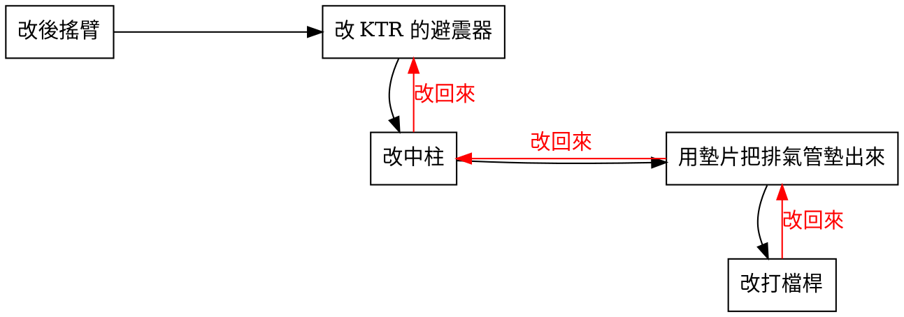

# 野狼避震器改太長的問題

想說改車總是環環相扣，所以簡單記錄一下自己遇到的一個改過頭的地方。
最後是改回來了啦！但是還是想記錄一下。

## 改打檔桿

讓故事從最後的反思的起點說起

2022 年 8 月最後改了打檔桿！發現，總算是美好的時刻，打檔桿其實鎖上時會有 gap 會搖晃，如果這樣踏久了，我想起動桿(插入引擎的那隻)的牙，遲早會因為這個間距被磨平(到時又要拆引擎才可以修)，所以就跑去退貨了。

退完貨之後，反思了自己是否要改打檔桿，通常是改腳踏後移時在改的(但我沒有改腳踏後移)，而且改了這個打檔桿，其實踩發踩下時，會比原廠的還低，感覺不是很好。

就想「為什麼要改打檔桿？」
原因是「排氣管墊出來，造成打檔桿會撞到」
那「排氣管為什麼要墊出來？」

就想起了以前的改裝決定。

## 用墊片把排氣管墊出來

因為當時有改裝中柱，[2016-7-28 09:12 有拍照貼文](/2016/07-28-bike/bike-stand/)

當時還看得出來擋腿還是擋得到中柱，但是後來，擋退漸漸的就擋不到中柱的擋片。
因為拉力變大，~~月形鐵片磨損車架加劇~~彈簧就慢慢的彈性疲乏。(後來換回來，中柱有點彈不回來了)

所以 5 年之後 2021/6/23 有重新焊接了中柱的擋片

但也因為擋片的位置不同，所以用墊片把排氣管墊出來一點，造成踩發桿要用的時候，才發現卡到排氣管。QQ

那...為什麼要改中柱？

問題又重新獲得了新的反思，太好了！

## 改中柱

改中柱主要的原因，就是改中柱的 7 年前，還在唸研究所在 [2009/01/01 改雲豹後搖臂](/2009/01-01-blogger/8176394082181294504/)時，同時換了 KTR 的避震器 (便宜二手貨)，看似原廠料的混搭風格，但其實並不是這麼協調。

其至有些地不平的地方
有些柏油路停車格，因為中柱停車+移車的關係，中柱與柏油磨擦，柏油會被刮下一層，所以立中柱的位置特別低。
像這種停車格我的車停上去就完全立不到中柱，就不能停這個位置，或者要用側邊柱停車，這樣又影響別人，很不好。

幾年之後把輪框改成前後 17 吋的禾倉三爪框，中柱不夠高的問題就稍微改善一點。(但有限)
但有時還是會覺得中柱長度不夠用，所以才想到要把中柱改長的想法。

看見網友介紹改寬胎狼中柱，完美直上，覺得很棒，但是網路上很多改裝文章似乎都沒有在講副作用 (搞得跟業配文一樣) 改上之後的問題完全沒有提到，跟著改的車友就也得到相同的副作用，其實很不好。(所以我都會盡量介紹我改裝完的副作用，盡量讓問題可以一次搞定)

但，當初的折衷決定「改 KTR 的避震器」是一個不小心的決定。
是時候再反思一下，是不是該把它換下來了嗎？？

## 改 KTR 的避震器

是因為改雲豹後搖臂時，我還是學生，因為當初預算不足的關係，所以換了長一點的便宜避震器，才選擇 350mm 的 KTR 的避震器。

現在已經過了多年之後，也算是可以換改裝的避震器的年紀，就想說來估算一下需要的規格看看。

就想到用[三角函數](https://forum.jorsindo.com/thread-2564705-1-1.html)算一下，適合的長度應該會是 330mm

所以，後來換上 330mm 的避震，原本的中柱就夠長了。
附上改回來的照片。(後來還有修改後土除，才像照片這樣，不然會微微磨到)

