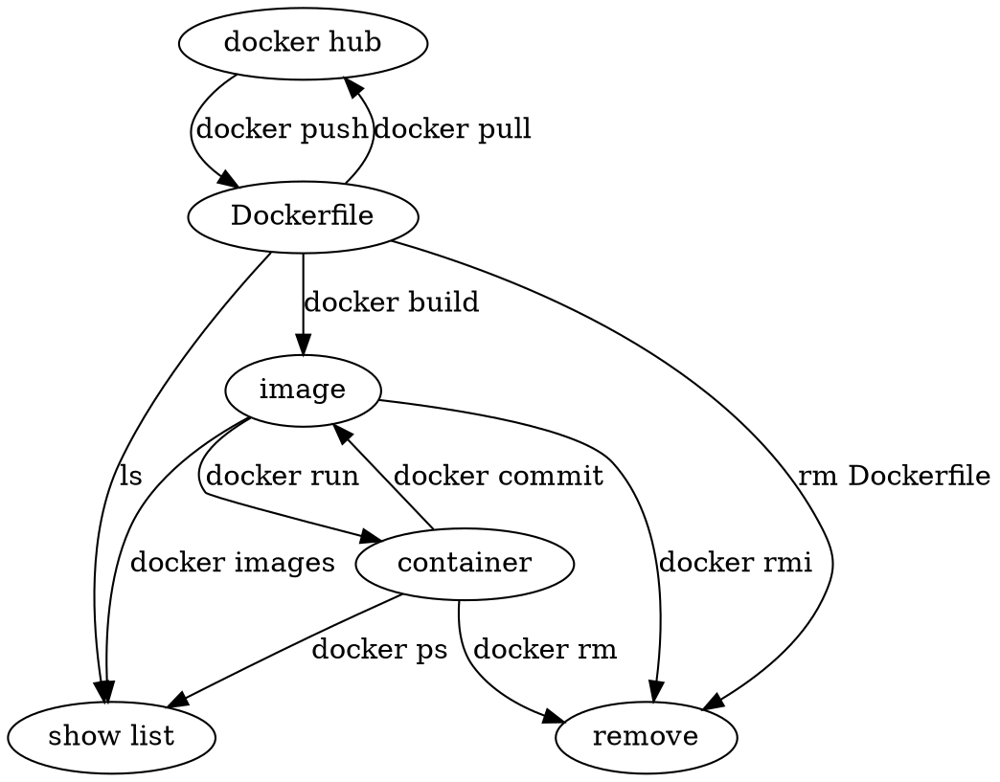

# Docker 指令關係筆記

一種將 OS 弄成 App 的技術。
將服務的執行環境完全隔離，彼此不受影響

## docker pull

拉下 ubuntu
`docker pull ubuntu`

指定版號
`docker pull ubuntu:14.04`

## Dockerfile

alpine 版本 專為 docker 而設
`node:<version>-alpine`
用 `docker exec -it erpbackend_web_1 /bin/sh` 使用 bash

## Dockerfile -> images

## images -> container

從本地環境的 image 建立 container
`docker run -idt nginx`

- `-d` 背景執行

互動式介面 tty
`docker run -it ubuntu`

container 建立同時命名
`docker run -it --name XXX ubuntu /bin/bash`

## container 操作

將 container 弄活
`docker start <container id>`

將 container 弄死
`sudo docker stop <container id>`

進入正在跑的 conatiner
`docker attache <container id>`

移除 container (要先弄死 container)
`docker rm <container id>`

列出 所有活的 containers
`docker ps`

列出 所有的活的死的 containers
`docker ps -a`

列出 container 執行 log
`docker logs <container id>`

## container -> image

`docker commit -m "add index.html" -a "curt" <container_id> <image id>`

- -a 作者

## 上傳 docker hub

要先把上傳的路徑
`docker tag <image id>`
`docker tag repository <帳號/reponame>`

上傳去!!!
`docker push reponame/projectname`
