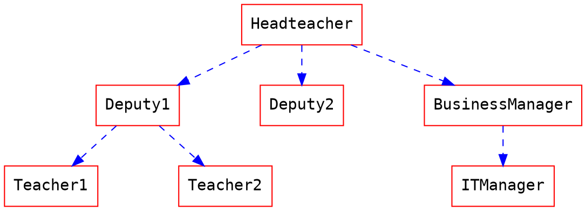
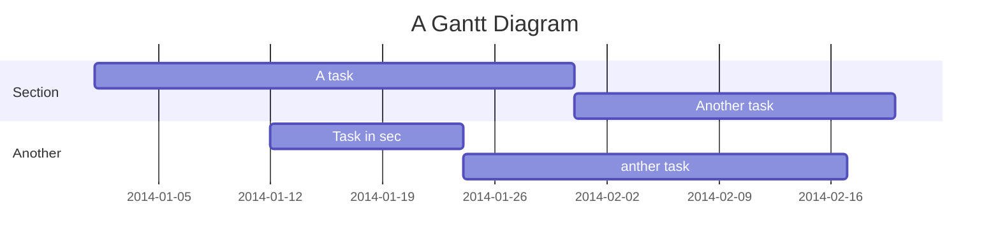

# 測試 hackmd 語法

此頁是用來測試到底支援了多少 hackmd 原本的寫法
不過，確實有許多功能不需要照本宣科的移植過來，畢竟身為 hackmd 的愛用者，只要夠用，而不是取代呀
所以，下面列出目前支援的語法與功能到什麼程度，標示danger區塊的則是*不支援*或*沒有這功能*的意思。

## 測試開始

功能介紹
===
**[English version](/features)**
**[中文版](/CwYwhgzAbApgHFAtHAnAIzY4awBNkwCsA7ImFCBCHAIxwBMhhIQAAA==)**
**[日本語版](/GwMxE4HYA4EMBMC0BTcwBMiAs94FZFpktZFIQ91pp1xwAjdPIA==)**

**請不要修改這份筆記** 非常謝謝您 :smile:
**如果要說 嗨 或是 玩些東西，請至 [遊樂場](/CwDgDAZgTFCcCmBaAhvAJgVkceA2AzIgEYDGIJiIGIU8GYRYJA7PkAAA)**

特賣會
===
**歡迎來自 Front-End Developers Taiwan 的各位！**:100:
**歡迎來自 g0v 的各位！**:+1:
**歡迎來自 程式人雜誌 的各位！**:smiley:

簡介
===
<i class="fa fa-file-text"></i> ** hackmd ** 是個跨平台的 Markdown 即時協作筆記
所以您可以在**電腦、平板甚至是手機**與其他人做筆記！
同時也可以在 **[首頁](/)** 透過 **Facebook、Twitter、GitHub、Dropbox** 登入

目前這個服務還在初步階段，所以可能會有點問題或是壞掉
如有任何狀況，請至 [GitHub](https://github.com/ hackmd io/ hackmd ) 回報問題
如果需要即時支援，請使用 [Facebook Message](https://www.facebook.com/messages/866415986748945)
**謝謝您！**

工作區
===
## 模式
**電腦 & 平板**

<i class="fa fa-edit fa-fw"></i> 編輯：只看到編輯器
<i class="fa fa-eye fa-fw"></i> 檢視：只看到結果
<i class="fa fa-columns fa-fw"></i> 同時：同時看到兩邊

**手機**

<i class="fa fa-toggle-on fa-fw"></i> 檢視：只看到結果
<i class="fa fa-toggle-off fa-fw"></i> 編輯：只看到編輯器

## 上傳圖片
只要按下這個按鈕 <i class="fa fa-camera"></i>
或是 **拖放** 圖片到編輯器，甚至 **貼上** 圖片也可以喔！
這會自動上傳圖片至 **[imgur](http://imgur.com)**，啥都不必煩惱了 :tada:


## 分享筆記
如果您想分享 **可編輯的** 筆記，複製這份文件的網址就好
如果您想分享 **只可讀的** 筆記，按下這個按鈕 <i class="fa fa-share-alt"></i> 然後複製網址

## 儲存
目前可以儲存至 **Dropbox** <i class="fa fa-dropbox"></i> 或是存放 **.md** <i class="fa fa-file-text"></i> 到您的本機

## 匯入
就像上面的儲存功能，您可以從 **Dropbox** <i class="fa fa-dropbox"></i> 匯入 **.md** <i class="fa fa-file-text"></i>
或是從 **剪貼簿** <i class="fa fa-clipboard"></i> 匯入，而且這可以轉換 **html** 喔 :smiley:

## 權限
檢視右上方有個小按鈕，您可以透過以下選項來更改權限：

<i class="fa fa-leaf fa-fw"></i> 隨意：任何人都可以更改這份筆記
<i class="fa fa-pencil fa-fw"></i> 可編輯：已登入使用者可以更改這份筆記
<i class="fa fa-lock fa-fw"></i> 鎖定：只有擁有者可以更改這份筆記
<i class="fa fa-hand-stop-o fa-fw"></i> 私有：只有擁有者可以更改與檢視這份筆記

**只有筆記的擁有者可以更改權限**

## 嵌入
```xml
<iframe width="100%" height="500" src="https:// hackmd .io/features" frameborder="0"></iframe>
```

## [簡報模式](./slide-example)
您可以使用一些語法將您的筆記分成投影片
然後用 **簡報模式** <i class="fa fa-tv"></i> 來展示，詳細請至上連結

檢視
===
## 目錄
在右下角有個目錄的小按鈕 <i class="fa fa-bars"></i>
按下它會顯示目前的目錄，而且會標明你所在的區塊
支援到**第三階段的標頭**

## 永久連結
每個標頭都會在右側自動加上永久連結
您可以在滑到上面並且按 <i class="fa fa-chain"></i> 去移到那個錨點

編輯
===
## 快速鍵
跟又快又方便的Sublime text很像
> 更多訊息請至 [這裡](https://codemirror.net/demo/sublime.html)

## 自動完成
提供完整的 Markdown 自動完成與提示
- 表情符號：輸入 `:` 顯示提示
- 程式碼區塊：
:::danger
(這一段顯示錯誤)
輸入   加上一個字元 顯示提示 <i hidden> </i>
:::
- 標頭：輸入 `#` 顯示提示
- 參考：輸入 `[]` 顯示提示
- 外部：輸入 `{}` 顯示提示
- 圖片：輸入 `!` 顯示提示

## 標題
會使用 **第一個第一級標頭** 作為筆記標題

## 標籤

:::danger
(這個語法的功能不同)
如同以下方式來使用標籤，它們會顯示在您的 **歷史紀錄**
###### tags: `功能` `酷` `更新`
:::

## [YAML metadata](./yaml-metadata)
提供描述筆記的資訊，以進階設定瀏覽行為，詳細請至上連結
- robots: 設定網路機器人 meta
- lang: 設定瀏覽器顯示語言
- dir: 設定文字方向
- breaks: 設定是否使用分行
- mathjax: 設定是否使用 mathjax

## 表情符號
您可以像是這樣使用表情符號 :smile: :smiley: :cry: :wink:
> 完整的表情符號列表 [在這裡](http://www.emoji-cheat-sheet.com/)

## 待辦清單
- [ ] 待辦
	- [x] 買些沙拉
    - [x] 刷牙
	- [ ] 喝水

## 程式碼區塊
我們支援非常多程式語言，使用自動完成來看看有些什麼
```javascript=
var s = "JavaScript syntax highlighting";
alert(s);
function $initHighlight(block, cls) {
  try {
    if (cls.search(/\bno\-highlight\b/) != -1)
      return process(block, true, 0x0F) +
             ' class=""';
  } catch (e) {
    /* handle exception */
  }
  for (var i = 0 / 2; i < classes.length; i++) {
    if (checkCondition(classes[i]) === undefined)
      return /\d+[\s/]/g;
  }
}
```
> 如果想要 **行號**，在表明程式語言之後輸入 `=`
> 您也可以指定開始行號，如下所示，行號從101開始

```javascript=101
var s = "JavaScript syntax highlighting";
alert(s);
function $initHighlight(block, cls) {
  try {
    if (cls.search(/\bno\-highlight\b/) != -1)
      return process(block, true, 0x0F) +
             ' class=""';
  } catch (e) {
    /* handle exception */
  }
  for (var i = 0 / 2; i < classes.length; i++) {
    if (checkCondition(classes[i]) === undefined)
      return /\d+[\s/]/g;
  }
}
```

:::danger
(這一段語法不吃，行號判定是`+`變NaN)
> 或是可以接續上一個程式碼區塊的行號，使用 `=+`

```javascript=+
var s = "JavaScript syntax highlighting";
alert(s);
```
:::

:::danger
(這一段語法不吃)
## 引用區塊標籤
> 您可以使用以下語法，表明自己的 **姓名、時間與顏色** 並與其他的引用區塊做區別
> [name=ChengHan Wu] [time=Sun, Jun 28, 2015 9:59 PM] [color=#907bf7]
> > 也支援巢狀引用區塊喔！
> > [name=ChengHan Wu] [time=Sun, Jun 28, 2015 10:00 PM] [color=red]
:::

## 外部

### Youtube


### Vimeo


### Gist


:::danger
(這一段語法不吃)
```markdown
### SlideShare


### Speakerdeck


### PDF
**注意：請使用 https 的網址，否則可能會被您的瀏覽器阻擋載入**

```
:::

## MathJax

您可以使用 **MathJax** 語法 來產生 *LaTeX* 數學表達式，如同 [math.stackexchange.com](http://math.stackexchange.com/)：

The *Gamma function* satisfying $\Gamma(n) = (n-1)!\quad\forall n\in\mathbb N$ is via the Euler integral

$$
x = {-b \pm \sqrt{b^2-4ac} \over 2a}.
$$

$$
\Gamma(z) = \int_0^\infty t^{z-1}e^{-t}dt\,.
$$

> 更多關於 **LaTeX** 數學表達式 [請至這裡](http://meta.math.stackexchange.com/questions/5020/mathjax-basic-tutorial-and-quick-reference)

## UML 圖表

### 循序圖

您可以像是以下使用循序圖：

```sequence
艾莉絲->包柏: 哈摟，你好嗎？
Note right of 包柏: 包柏思考中
包柏-->艾莉絲: 我很好，謝謝！
Note left of 艾莉絲: 艾莉絲回應
艾莉絲->包柏: 最近過得怎樣？
```

### 流程圖

您可以像是以下使用流程圖：
```flow
st=>start: 開始
e=>end: 結束
op=>operation: 我的操作
op2=>operation: 啦啦啦
cond=>condition: 是或否？

st->op->op2->cond
cond(yes)->e
cond(no)->op2
```

### Graphviz


:::danger
(這一段語法不吃)
### Mermaid


> 更多關於 **循序圖** 語法 [在這裡](http://bramp.github.io/js-sequence-diagrams/).
> 更多關於 **流程圖** 語法 [在這裡](http://adrai.github.io/flowchart.js/).
> 更多關於 **Graphviz** 語法 [在這裡](http://www.tonyballantyne.com/graphs.html)
> 更多關於 **Mermaid** 語法 [在這裡](http://knsv.github.io/mermaid)
:::

警告區塊
---
:::success
耶 :tada:
:::

:::info
這是訊息 :mega:
:::

:::warning
注意 :zap:
:::

:::danger
喔不 :fire:
:::


## 排版

### 標頭

```
# h1 標頭
## h2 標頭
### h3 標頭
#### h4 標頭
##### h5 標頭
###### h6 標頭
```

### 水平分隔線

___

---

***


### 字形替換

(c) (C) (r) (R) (tm) (TM) (p) (P) +-

測試.. 測試... 測試..... 測試?..... 測試!....

!!!!!! ???? ,,

Remarkable -- awesome

"Smartypants, 雙引號"

'Smartypants, 單引號'

### 強調

**這是粗體文字**

__這是粗體文字__

*這是斜體文字*

_這是斜體文字_

~~這是刪除文字~~

上標： 19^th^

下標： H~2~O

++這是底線文字++

==這是標記文字==


### 引用區塊


> 引用區塊也可以是巢狀的喔...
>> ...可以多層次的使用...
> > > ...或是用空白隔開


### 清單

#### 項目

+ 在行開頭使用 `+` `-` 或是 `*` 來建立清單
+ 空兩個空白就可以產生子清單
  - 當清單標記使用的字元不同，會強制建立新的清單
    * Ac tristique libero volutpat at
    + Facilisis in pretium nisl aliquet
    - Nulla volutpat aliquam velit
+ 非常簡單！

#### 編號

1. Lorem ipsum dolor sit amet
2. Consectetur adipiscing elit
3. Integer molestie lorem at massa


1. 您可以逐次增加項目數字...
1. ...或是全部都使用 `1.`
1. feafw
2. 332
3. 242
4. 2552
1. e2

從其他範圍開始編號清單

57. foo
1. bar

### 程式碼

行內 `程式碼`

縮排程式碼

    // Some comments
    line 1 of code
    line 2 of code
    line 3 of code


程式碼區塊

```
Sample text here...
```

語法標色

``` javascript
var foo = function (bar) {
  return bar++;
};

console.log(foo(5));
```

### 表格

| 選項 | 描述 |
| ------ | ----------- |
| data   | path to data files to supply the data that will be passed into templates. |
| engine | engine to be used for processing templates. Handlebars is the default. |
| ext    | extension to be used for dest files. |

向右對齊

| 選項 | 描述 |
| ------:| -----------:|
| data   | path to data files to supply the data that will be passed into templates. |
| engine | engine to be used for processing templates. Handlebars is the default. |
| ext    | extension to be used for dest files. |

向左對齊

| 選項 | 描述 |
|:------ |:----------- |
| data   | path to data files to supply the data that will be passed into templates. |
| engine | engine to be used for processing templates. Handlebars is the default. |
| ext    | extension to be used for dest files. |

置中對齊

| 選項 | 描述 |
|:------:|:-----------:|
| data   | path to data files to supply the data that will be passed into templates. |
| engine | engine to be used for processing templates. Handlebars is the default. |
| ext    | extension to be used for dest files. |


### 連結
[連結文字](http://dev.nodeca.com)
[加上標題的連結文字](http://nodeca.github.io/pica/demo/ "標題文字！")
自動轉換連結 https://github.com/nodeca/pica


### 圖片


如同連結一般，圖片也可以用註腳語法
![Alt text][id]
使用參考，可以在稍後的文件中再定義圖片網址

[id]: https://octodex.github.com/images/dojocat.jpg  "The Dojocat"


使用指定的大小顯示圖片

### 註腳

註腳 1 連結[^first].
註腳 2 連結[^second].
行內註腳^[行內註腳的文字] 定義
重複的註腳參考[^second].

[^first]: 註腳 **也可以標記**
    還可以有很多段落
[^second]: 註腳 文字

### 定義清單

名詞 1

:   定義 1 快速連續項目

名詞 2 加上 *行內標記*

:   定義 2

        { 這些程式碼屬於 定義 2 的一部分 }

    定義 2 的第三段落

_緊密樣式：_

名詞 1
  ~ 定義 1

名詞 2
  ~ 定義 2a
  ~ 定義 2b

### 縮寫

這是 HTML 的縮寫範例
它會轉換 'HTML'，但是縮寫旁邊其他的部分，例如："xxxHTMLyyy"，不受影響

*[HTML]: Hyper Text Markup Language
