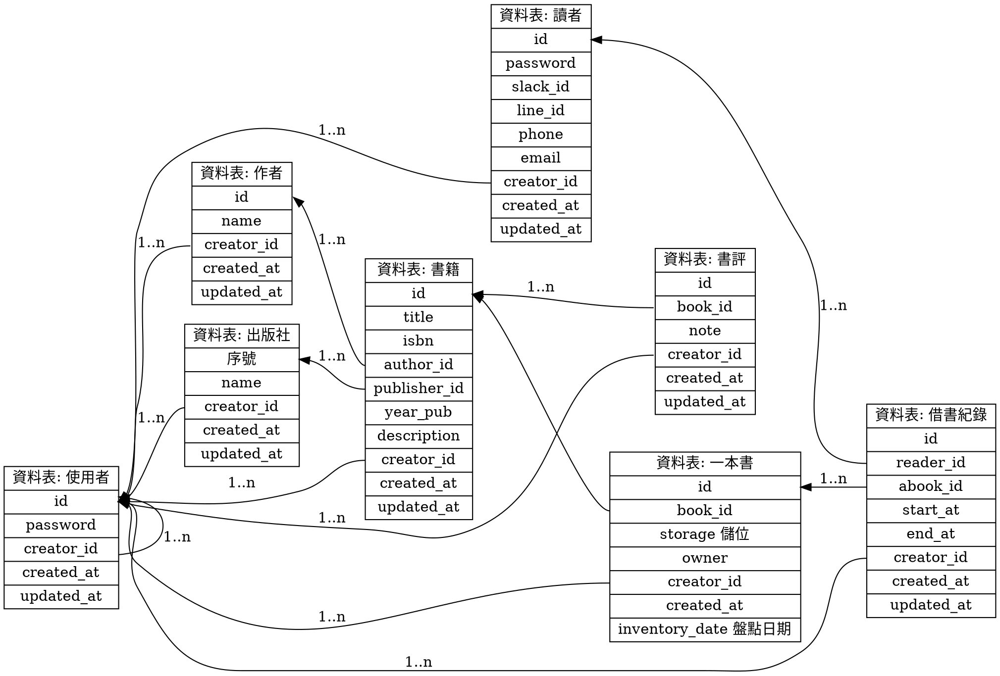

## 選用 MariaDB

MariaDB 是一種資料庫系統，也是一個資料庫是一個伺服器，可以使用。MariaDB 一開始開發出來和 MySQL 相容，依相容性來考量選擇它。

## 資料庫設計

因為目前還只是要練習，所以先將資料庫設計給做好。
之後就以「實現這個設計」來學習需要的技術。



## 使用者登入

使用 mycli，用法和 `mysql`/`mariadb` 一樣

```shell
mycli -u <user> -h <host> -p <password> <database name>
```

- `-u (user)`: 帳號
- `-p (password)`: 密碼 (空值: 提示輸入)
- `-h (host)`: 主機位址或IP (遠端主機必填)
- `database name`: 指定登入就使用的資料庫(在此沒有指定)

### 登入的安全性問題

使用 `$ mycli -u <user>` 的話，會透過問答方式輸入密碼，避免密碼留在指令紀錄上，使用 history 可以查得到

```shell
$ mycli -u admin
Connecting to socket /var/run/mysqld/mysqld.sock, owned by user mysql
Password: 
MariaDB 10.5.19
mycli 1.26.1
Home: http://mycli.net
Bug tracker: https://github.com/dbcli/mycli/issues
Thanks to the contributor - Roland Walker
MariaDB admin@(none):(none)>
```

使用管理者權限進入 `my-cli` 

```shell
$ mycli -u root
MariaDB root@(none):(none)>
```

> 在此尚未有資料庫要指定，所以就保持空白就好。

## 新增資料庫

```sql
MariaDB root@(none):(none)> CREATE DATABASE good_ideas_lib
Query OK, 1 row affected
Time: 0.002s
```

可以在資料來看見 good_ideas_lib 的檔案出現

```bash
/var/lib/mysql $ ls -l
總用量 122932
-rw-rw---- 1 mysql mysql     24576  7月 12 16:53 aria_log.00000001
-rw-rw---- 1 mysql mysql        52  7月  7 08:17 aria_log_control
-rw-r--r-- 1 root  root          0  6月 28 15:57 debian-10.5.flag
drwx------ 2 mysql mysql      4096  7月 12 16:48 good_ideas_lib
-rw-rw---- 1 mysql mysql       972  6月 28 15:57 ib_buffer_pool
-rw-rw---- 1 mysql mysql  12582912  6月 28 15:57 ibdata1
-rw-rw---- 1 mysql mysql 100663296  7月  7 19:27 ib_logfile0
-rw-rw---- 1 mysql mysql  12582912  7月  7 19:27 ibtmp1
-rw-rw---- 1 mysql mysql         0  6月 28 15:58 multi-master.info
drwx------ 2 mysql mysql      4096  6月 28 15:57 mysql
-rw-r--r-- 1 root  root         15  6月 28 15:57 mysql_upgrade_info
drwx------ 2 mysql mysql      4096  6月 28 15:57 performance_schema
```

用系統管理員可以進去看這個資料夾，新增了一個檔案 `db.opt`

```bash
/var/lib/mysql/good_ideas_lib# ls
db.opt
```

回到 mycli 指定帳號給資料庫

```sql
GRANT ALL PRIVILEGES ON good_ideas_lib.* TO 'admin'@'localhost'
```
```shell
Query OK, 0 rows affected
Time: 0.009s
```

### 離開 mycli 的環境

**換帳號**

```sql
MariaDB root@(none):(none)> exit
Goodbye!
```

```shell
$ mycli -u admin -h localhost -p pi good_ideas_lib
Connecting to socket /var/run/mysqld/mysqld.sock, owned by user mysql
MariaDB 10.5.19
mycli 1.26.1
Home: http://mycli.net
Bug tracker: https://github.com/dbcli/mycli/issues
Thanks to the contributor - Huachao Mao
```

進入之後會出現

```sql
MariaDB admin@localhost:good_ideas_lib>
```

成功！


## 新增資料表[^create-table]

[^create-table]: [CREATE TABLE](https://mariadb.com/kb/en/create-table/)

新增資料表時，使用的命名都用「單數」的名詞 (ex: book, user)

```sql
CREATE TABLE user (
  id CHAR PRIMARY KEY,
  name CHAR,
  password CHAR,
  created_at DATETIME,
  updated_at DATETIME
)
```

```shell
Query OK, 0 rows affected
Time: 0.018s
```

## 看資料表[^describe]

[^describe]: [DESCRIBE](https://mariadb.com/kb/en/describe/)

```sql
DESCRIBE `user`
```

```shell
+------------+----------+------+-----+---------+-------+
| Field      | Type     | Null | Key | Default | Extra |
+------------+----------+------+-----+---------+-------+
| id         | char(1)  | NO   | PRI | <null>  |       |
| name       | char(1)  | YES  |     | <null>  |       |
| password   | char(1)  | YES  |     | <null>  |       |
| created_at | datetime | YES  |     | <null>  |       |
| updated_at | datetime | YES  |     | <null>  |       |
+------------+----------+------+-----+---------+-------+

3 rows in set
Time: 0.067s
```

在建構 TABLE 時，id, name, type 的資料型別都只是使用 `CHAR` 宣告，系統就直接只給 `CHAR(1)`。這並不符合需求，來學一下如何刪除資料表之後，再重建一次吧！

## 刪除資料表[^drop-table]

[^drop-table]: [DROP TABLE](https://mariadb.com/kb/en/drop-table/)

刪除指令比較危險，所以會先確認是否要刪除，才會刪除

```sql
DROP TABLE user;
```

```shell
You're about to run a destructive command.
Do you want to proceed? (y/n): y
Your call!
Query OK, 0 rows affected
Time: 0.013s
```

### 重新再新增資料表

- `id` 
  - 資料型別用 `INT`，因為 user 指的是系統後台使用者，並不是讀者。
    - 如果要記錄身份證字號，可以用 `CHAR(10)`，共十碼，英文開頭。
    - 如果是流水號，可以選用 `INT`
    - 如果想要用唯一碼並不想要流水號，可以用 `UUID`
  - 如果想要自動生成 可以用 `AUTO_INCREMENT` 讓它在新增資料時，不給初值也會有值。
  - `PRIMARY KEY` 不可以重複，資料在整個資料表是唯一值。
- `name` 
  - 字串改用 `VARCHAR` (utf-8)，`VARCHAR(50)` 是將資料宣告成可變動字串
  - 宣告的數字是最大長度。
- `password` 因為想要使用 hash 取 128 位數。
  - 設定成 `CHAR(128)` 固定字串長度 128。
- `created_at`、`updated_at` 都使用 `DATETIME` 記錄日期時間

```sql
CREATE TABLE user (
  id INT NOT NULL AUTO_INCREMENT,
  name VARCHAR(50) NOT NULL,
  password CHAR(128) NOT NULL,
  created_at DATETIME,
  updated_at DATETIME,
  PRIMARY KEY (id)
) ENGINE = InnoDB;
```

```sql
DESCRIBE `user`
```

```shell
+------------+-------------+------+-----+---------+----------------+
| Field      | Type        | Null | Key | Default | Extra          |
+------------+-------------+------+-----+---------+----------------+
| id         | int(11)     | NO   | PRI | <null>  | auto_increment |
| name       | varchar(50) | NO   |     | <null>  |                |
| password   | char(128)   | NO   |     | <null>  |                |
| created_at | datetime    | YES  |     | <null>  |                |
| updated_at | datetime    | YES  |     | <null>  |                |
+------------+-------------+------+-----+---------+----------------+

5 rows in set
Time: 0.043s
```

### SQL 小重點

- SQL 的語法: `;` 結尾
- 基本慣例
  - 指令保留字使用大寫
  - 資料庫、資料表、欄位，都用小寫 + 底線
- 限制
  - 資料庫和資料表的名稱，在 Linux 上，要區分大小寫 (因為它們是檔名)
  - 欄位名稱，不區分大小寫

