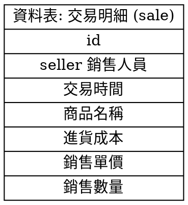
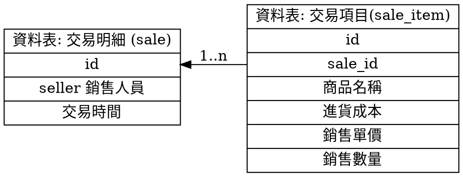
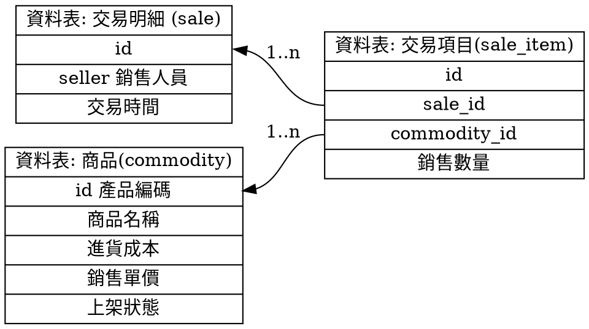
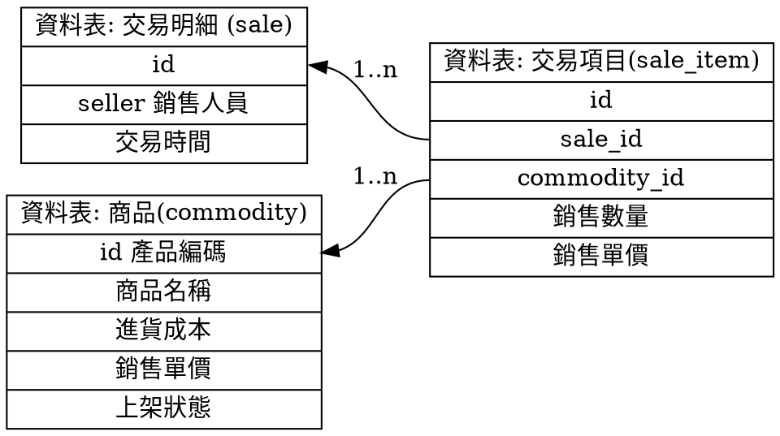

# 資料庫設計之共用/不共用欄位

資料庫正規化的原則就是將重複的欄位共用。

但是這個案例就是一個，不應該共用的例子，一起來看看吧。

## 收銀機的交易資料

收銀機，在每一次交易時，都要打交易明細。而明細的欄位，不外乎就是這次賣出去的品項、金額、數量、收銀人員，交易時間....，資料庫的設計如下。(簡易設計，之後帶出我想討論的問題，省略與問題無關的欄位)

而如果想要計算銷售的利潤，需要將成本記錄進來。

每一次交易，不是只有一筆商品名稱，如果要一次產出很多筆商品，就要讓交易明細表，分成兩個部份，交易與交易明細，也就是俗稱的表頭與表身的稱呼

## 交易、交易明細

每一次交易只需要一筆資料的是交易時間、銷售人員。
而需要多筆的是客人買的東西相關的資料，包含商品名稱、銷售單價、銷售數量、進貨成本 (可以算利潤)。

這看似更加適合記錄交易行為資料的結構，應該再加上自己需要的欄位就可以運作了才對，但是這樣的設計會在統計上造成問題。

商品名稱，這個欄位看似是一個手動輸入的欄位。
也許會打成全名、簡稱、甚至打編號，又或者考慮錯誤的話，會打錯字，也許會多打空白，在輸入時造成各種的錯誤會讓統計時，將它們視為不同的品項。

所以，需要將商品變成選項，用選的降低這方面的錯誤

## 商品

加入了商品資料，就要反覆的問自己「商品的這個屬性，會跟著選項走嗎？」

- 交易項目的**名稱**，會跟著商品選項改變嗎？會
- 交易項目的**成本**，會跟著商品選項改變嗎？會
- 交易項目的**單價**，會跟著商品選項改變嗎？會
- 交易項目的**數量**，會跟著商品選項改變嗎？不會

由於數量是每一次買賣才決定的，所以不跟著商品選項改變。
所以資料表設計如下，感覺又更加完整了，不只是可以共用該共用的欄位，又可以避免商品輸入的錯誤

其實做到這樣的設計，正一步步的進入另一個陷阱中。
讓我們再重新看一下這樣的設計，然後思考一個情境

**如果今天商品的單價調整了，不管是漲還是降，那過去的交易明細內容會跟著修改嗎？**

## 記錄歷史的資料庫設計

其實，在一開始的命題就已經決定了這一個要素**記錄歷史**，記帳也是一種歷史記錄的建立。
而這一份歷史是無法變被變更的，尤其是它要解決的問題: 記錄交易，算帳用的

那我們在設計資料表時，要記得檢查**資料連動的問題是否與問題本質衝突**。

所以在建立交易項目時，交易的金額需要複製一份記錄下來，交易明細以此為基礎做計算。
**交易的金額需要成為歷史**，**銷售單價**×**銷售數量**的計算就會固定下來。

那交易的商品名稱需要嗎？這就看你自己囉！如果品名修改了，歷史的名稱修改是不是被允許的呢？

在此，我們就將**銷售單價**，加在交易項目上，也沒有將商品的**銷售單價**取消。

在現實世界中，其實這兩者本來就有差，一個是**訂價**，一個是**售價**。
隨著資料庫正規化的過程，其實整個問題也需要再一次的重新描述，才會從一開始的**售價**資料，延伸出**訂價**資料，不會視為相同的一件事。

這個問題在資料庫正規化並不會浮現，而我們會踩進這個誤區造成設計不良。